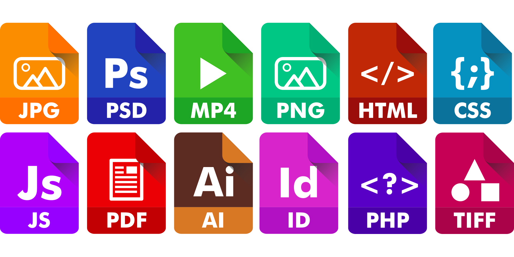

 

## First contact with Javascript

In FreeCodeCamp, I completed and learned the fundamentals of JavaScript, including variables, arrays, objects, loops, and functions. According to my understanding, the three most essential elements of front-end web development: are HTML, CSS, and JavaScript. A characteristic of front-end development is that many UI libraries and frameworks exist where Javascript is concerned. 

But as a programming language, it is not particularly rigorous because the syntax could be more relaxed. And Javascript doesn't require a compiler to run. But one thing I'm apprehensive about is that I don't know how well Javascript is compatible. 

Because javascript depends on the browser, more and more browsers exist on the market. So consider I will take this into account. But it's not something I should be thinking about now, so I'll make slightly more detailed comparisons with the languages I've learned and javascript and why I think javascript is more manageable for newcomers to start programming.

## Back-end Languages vs. Javascript

First, I will compare Javascript and Java. Java is mainly used in data centers, computers, cell phones, and the Internet. In comparison, Javascript is primarily used for websites. Although Javascript has Java in its name, Javascript and Java are developed by different companies, and Javascript is a scripting language, while Java is an object-oriented programming language. In addition, Javascript is a dynamically typed language (the types of variables are known only when the program is run), and Java is a statically typed language.
In learning Javascript, I found that Javascript is flexible about variable declarations (variable types), while Java, like most back-end languages, requires all variables to be declared before compilation. Compiling the program is not the same: C/C++ must compile the code manually after the programmer writes it. The system's CPU executes the program directly without any additional virtual machine. Javascript, on the other hand, Javascript does not require any compilation of the code by the programmer. Java, however, is not the same as Javascript and C. Java requires a virtual machine for the code, which brings us to the comparison between JavaScript and Java. The Java language compiles the source code into bytecode, separate from the execution phase. That is, the length of time from the source code to the abstract syntax tree to the bytecode is indifferent; with JavaScript, these are implemented in the loading and rendering process of the web page along with the execution phase after the download of the web page and JavaScript files, so there are strict requirements for their processing time. 

Reference: <a href="https://www.thesoftwareguild.com/faq/difference-between-java-and-javascript/#:~:text=JavaScript%20code%20is%20written%20completely,on%20HTML%20documents%20and%20browsers.">What is the Difference Between Java and JavaScript?</a>

## Style of Learning

I've noticed that athletic software engineering is a great but challenging way to learn, just like an athlete's tedious and challenging daily training. The ICS 314 course uses this learning style, and we have practiced WODs (programming exercises). It's a significant exercise, and the daily programming allows students to become more familiar with the programming language and the workflow for their future jobs. This way of learning can be more or less stressful because everyone's major and the number and difficulty of the courses are different. And it's a test of the student's time management. For me, it was stressful but inspiring and positive. For the current WODs, it helps my brain to think very well. So it's beneficial for me.
