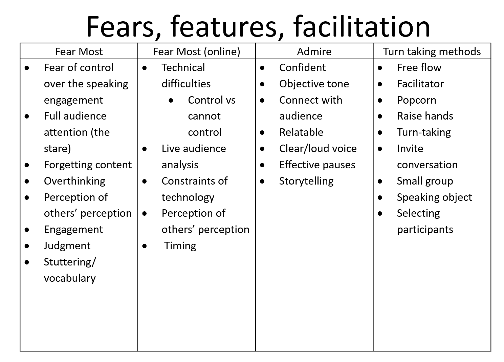

This is an internship and training in ethical issues and teaching skills which help other students succeed in ICS courses.

## Public Speaking

My biggest fear with public speaking is that not shortening or keeping the presentation time better will result in a speech that is too wordy and shows an unprofessional explanation of myself. For online presentations I think I would be easily distracted by the rest of the presentation. It's easier to get myself into a particularly relaxed state when speaking at home or in a place I'm familiar with, which can lead to bigger mistakes.

A public speaker I admire is the 44th President, Barack Obama. His speeches are gentle yet impactful, and his pauses during his speeches are powerful. It hits me very close to home.

One rotation method I have learned to use is for each person to express what they want to say in a limited amount of time, and then shorten the time each time the exchange rotates. This can help yourself and others understand, and this approach works well in online formats as well.

After discussing face-to-face and online public speaking in class, I think there are more disadvantages to face-to-face than online. But the feedback given face-to-face is better and more challenging. Because what comes from the body language available for online presentations is to give the audience a better understanding. Whereas in ARCS strategies, I think there is a better chance of having a small group to allow everyone to have a discussion. Allowing the group to voluntarily assign the content of the presentation would also help all members of the group to consolidate the results of their discussion (I think random assignment would work better). With the number of courses I have this semester and the requirements of the different courses, I think I will assign different work times each day for each course based on assignment submission times.

