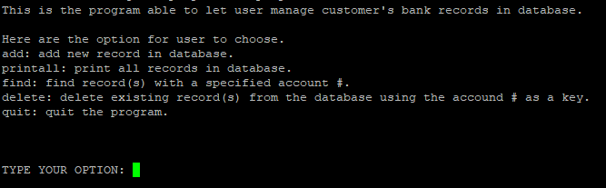

This project was compeleted and updated to C++ during fall 2022, ICS 212. This Application have user-interface that allow user to interacte with all the option they want. Once user had input all requested information in the interface, program will record and order it in descending order in the database. 

In database program which will do: Add record, print all records, find record, and delete record. Here are some source code you can have a look.

addRecord: by given user account numbers, name and address. This function will list the record in the correct position and soted in descending order of account numbers
printAllRecords: print out all the record that database had recorded 
findRecord: find record(s) with a account number
deleteRecord: delete record(s) with a account number

Source code: <a href="https://github.com/Alexander-Hung/alexander-hung.github.io/tree/main/projects/bank-database-application/code.c">/projects/bank-database-application/code.c</a>

**Update:**

Here is a update for the project, I successed made the application with C++. In addition, database will write the record into a binary file which can pervide more security of the file.

Source code: <a href="https://github.com/Alexander-Hung/alexander-hung.github.io/tree/main/projects/bank-database-application/code.cpp">/projects/bank-database-application/code.cpp</a>
