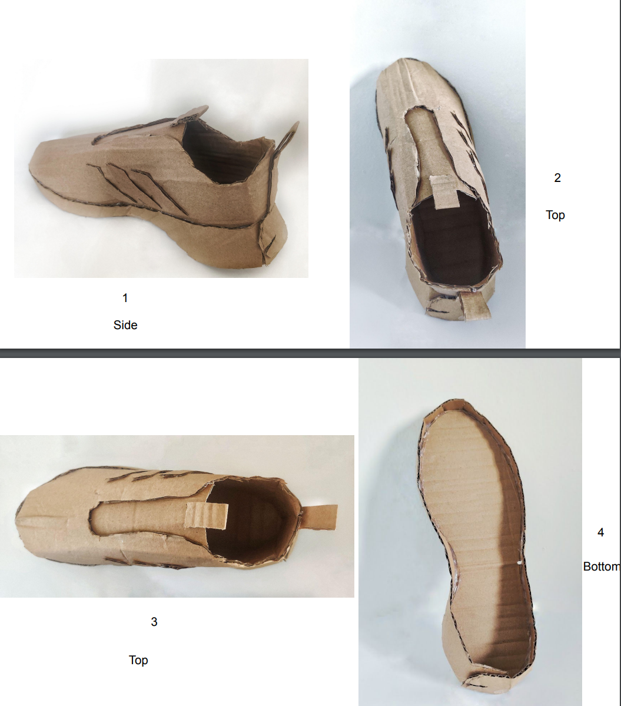
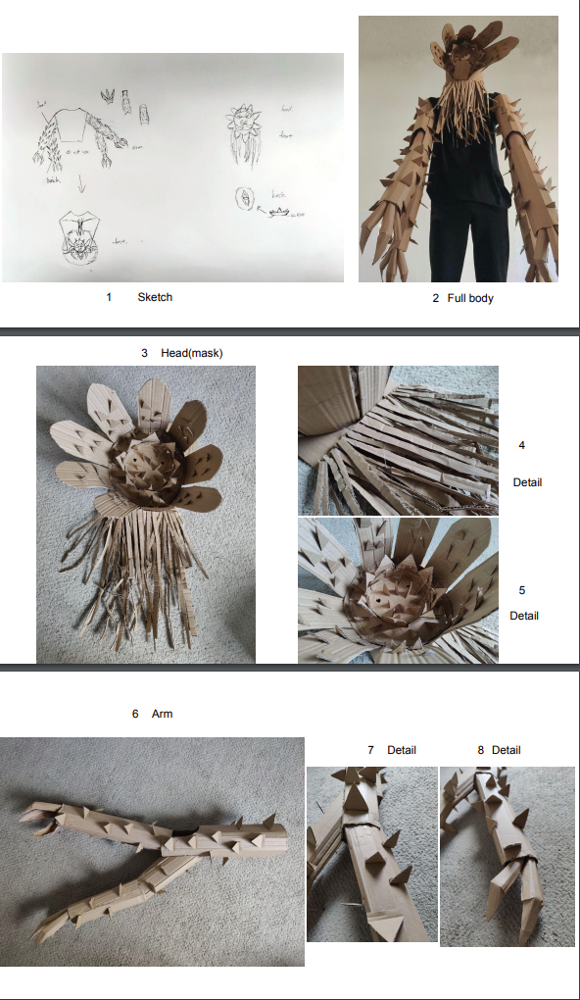
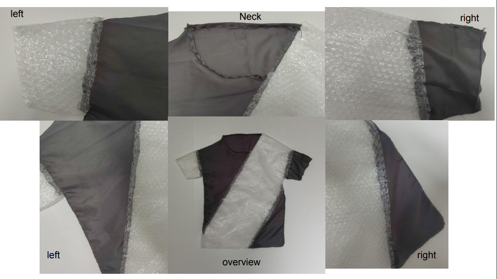
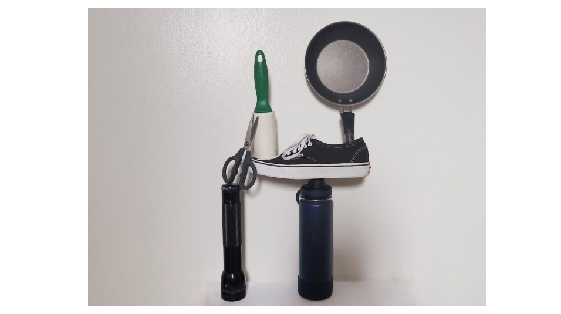
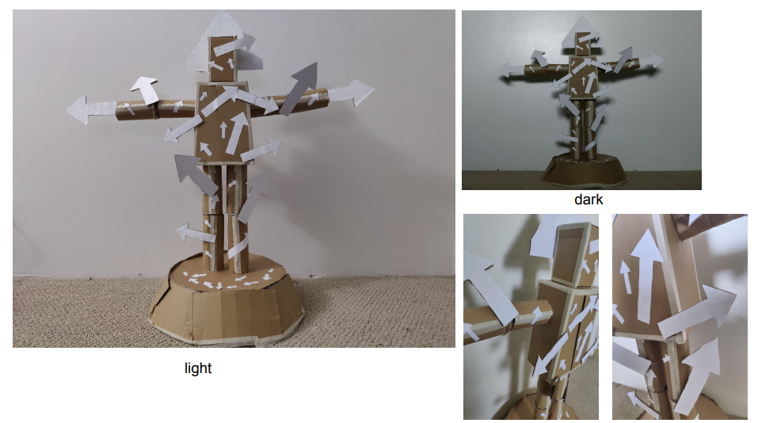

Planes and patterns: 

- Task: Recreate a selected closed toe shoe in exquisite detail completely from cardboard.
- Insight: The shoe is divided into two parts: the bottom and the body. Insert the body into the bottom 
in order to fix the shoe shape. How difficult it is to use cardboard to make an exquisite shoe, and how 
fine the shape of the design needed to make the shoe needs to be in order to assemble a shoe.

Body transformations share out:

- Task: Create a cardboard (or wood) sculpture that is placed on your body and in doing so transforms your 
body.
- Insight: Cut the cardboard according to the draft, and make small parts separately to create details. Using
cardstock takes a lot of time to make details, art takes time.

Soft - Materials and metaphors:

- Task: deconstruct a pre-existing object - something worn or made for the human body and reconstruct that 
form in a different material or materials so as to either exaggerate, contradict or subvert the object’s 
original meaning.
- Insight: The combination of two different types of materials will change the meaning of the item itself. 
And this meaning is closely related to itself. For example, I use bubble wrap because I moved to Honolulu not
long ago resulting in a large amount of bubble wrap in my home.

Goldsworthy inspired site-specific sculpture: 

- Task: Create and document a temporary sculpture in the spirit of Fischli and Weiss’ Equilibre/Quiet 
Afternoon using found objects from around the house.
- Insight: How to choose items to make a scene is difficult, because each item must have its own meaning.

Agency - The relational body: 

- Task: Create a physical sculpture that connects you to another social creature, elemental force, 
building or spiritual entity, and in doing so enhances or impeded an intended relationship.
- Insight: The use of arrows on the body can express the flow of blood in the human body and also
expresses that people have different directions for their lives.

