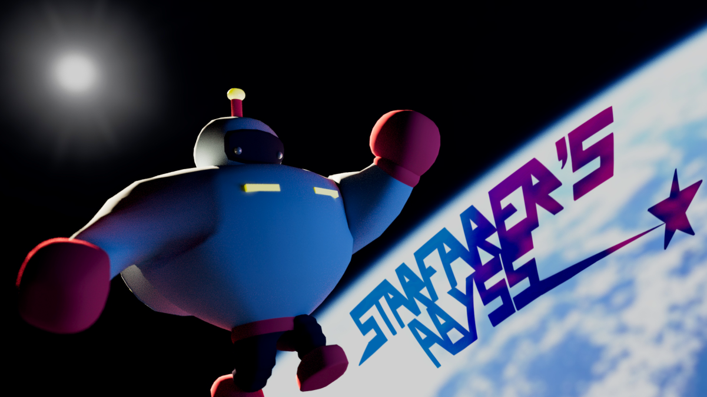

## Demo

Click image to Watch the video

## Description

You are the last survivor of your crew after the Glor aliens have hijacked your ship! Explore your ship and defeat the enemy aliens to gain items and upgrades, all while figuring out a way to get these aliens to leave your ship for good!

## Instructions

As humanity’s strongest soldier you are tasked with saving your ship:
1. Defeat aliens to collect weapon upgrades, keys, and teleporter scraps 
2. Use the keys to unlock doors for health & armor upgrades 
3. Once 3 teleporter scraps are collected, combine the teleporter scraps to enter the control room, fix the security system and save your ship!
4. Stay alive!

## What’s Next

- Animations 
  - Improved movements for player and aliens 
- Alternative Ending/ Additional Challenges
  - A boss fight
- Enemies 
  - More complex enemy behaviour

## Team

The Rizz-tronauts:
Gwyneth Raquepo, Kayla Hirano, Anh Nguyen, Marissa Halim, Alexander Hung

## Link

#### <a href="https://github.com/Alexander-Hung/ICS369-Final-Project">Click for Project Repo</a>

#### <a href="https://youtu.be/-nENgiX8vfo">Click for Demo Video</a>
