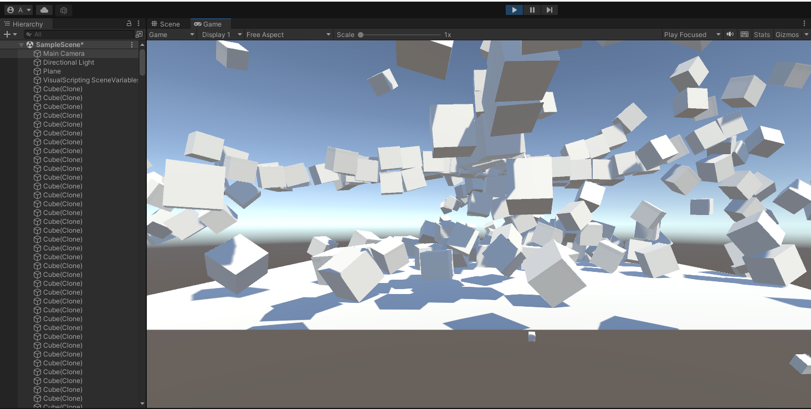
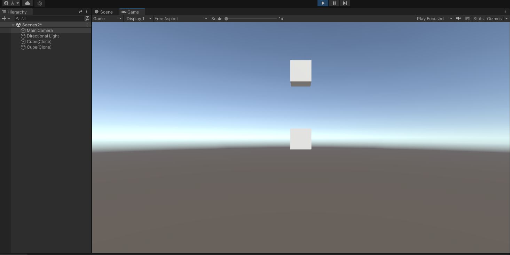

To start with the unity, I going to test and find out how to make an object drop.



I found out if you just add physical properties to an object, the object will only be created infinitely and no extra objects will be deleted. But in C# script, I can wrote the time when the object will be spawn, and everytime it spawn will add component to the object which will destroy all the object when its y = 0.

Drops.sc

```ruby
elapsedTime += Time.deltaTime;
    if (elapsedTime >= delayBetweenDrops) {
        elapsedTime = 0f;
	GameObject n = Instantiate(prefab);
	n.AddComponent(typeof(CubeScript));
    }
```

CubeScripte.sc

```ruby
if(transform.position.y < 0) {
    Destroy(gameObject);
}
```
Drops.sc is the script make the object show in the scene, it's a component that control the time the object spawn and add component to every object it spawn.


Here's what it look like in the play mode.


<sub>**Update will coming soon:**</sub>

<sub>Unity game project</sub>
