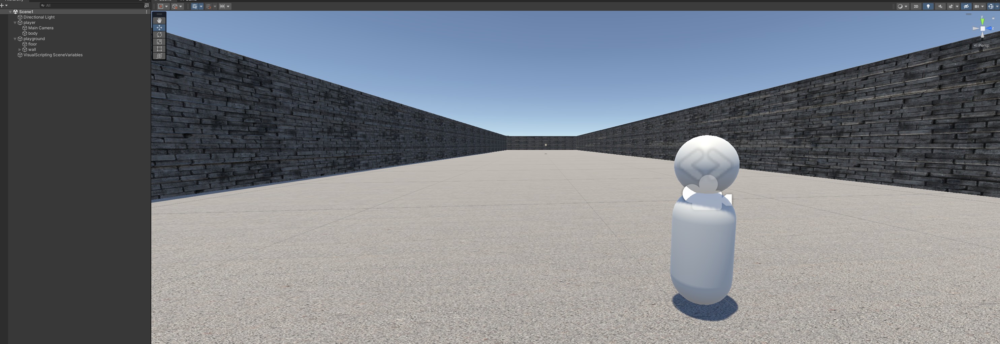
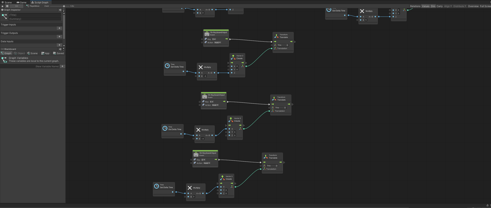

- 3D Object: 
  - Prefab: use basic 3D object to create every game object and scenes object.
  - Camera: Camera that show the view for players.
  - Texture: By adding picture or color to add the texture to 3D object.



- Scenes: scenes and use all assets, 3D object and script to make players see everything that designer want to show.

- Script:
  - Script Graph: use different notes to do all function what coding script can do.

    

  - C# Script: C# coding that have more available function that can make action even easier.

```ruby
using System.Collections;
using System.Collections.Generic;
using UnityEngine;

public class PlayerJump : MonoBehaviour
{
    public float speed = 10f;
    public Rigidbody rb;
    private bool _isJumping = false;
    // Start is called before the first frame update
    void Start()
    {
        rb = GetComponent<Rigidbody>();
    }

    // Update is called once per frame
    void Update()
    {
        if (Input.GetKeyDown(KeyCode.Space) && _isJumping == false)
        {
            rb.AddForce(Vector3.up * speed, ForceMode.Impulse);
            _isJumping = true;

        }
    }

    void OnCollisionEnter(Collision collision)
    {
        if (collision.gameObject.tag == "Platform")
        {
            _isJumping = false;
        }
    }
}
```
